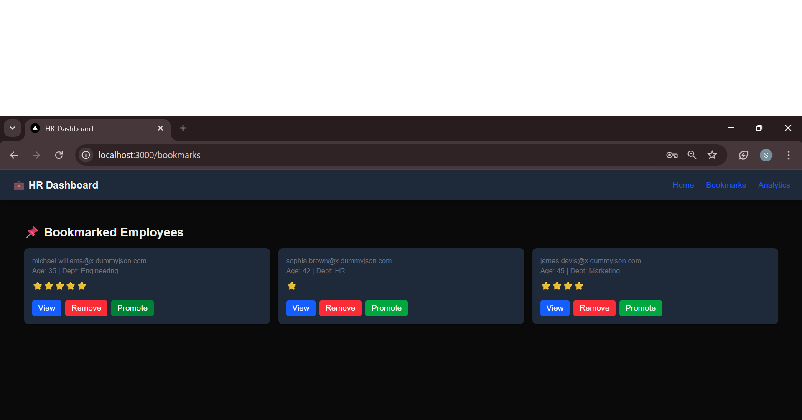

# HR Performance Dashboard

This project is a full-featured HR Dashboard built with Next.js (App Router), Tailwind CSS, and JavaScript. It allows HR teams to track employee performance, manage bookmarks, and analyze department trends through an intuitive, responsive interface.

## Tech Stack

- Next.js (App Router)
- React
- Tailwind CSS
- JavaScript (ES6+)
- Zustand (state management)
- Chart.js (for analytics)
- Framer Motion (for tab animations)

## Features

### 1. Dashboard Homepage (`/`)
- Fetches and displays employee cards from `https://dummyjson.com/users?limit=20`
- Shows name, email, age, department, and rating
- Actions: `View`, `Bookmark`, `Promote`

### 2. Search & Filter
- Real-time search by name, email, or department
- Multi-select filters for department and rating

### 3. Employee Details Page (`/employee/[id]`)
- Overview: Full profile with rating, address, bio, phone
- Projects: List of projects
- Feedback: Feedback form with validation
- Tabbed UI with animated transitions (Framer Motion)

### 4. Bookmarks Page (`/bookmarks`)
- View all bookmarked employees
- Remove from bookmarks
- Trigger mock actions like Promote or Assign to Project

### 5. Analytics Page (`/analytics`)
- Chart.js visualizations:
  - Department-wise average performance
  - Bookmark trends

## Bonus Features

- Pagination for homepage employee list
- Component-level loading and error states
- Custom hooks: `useBookmarks`, `useSearch`
- Modular folder structure (`components/`, `hooks/`, `data/`, etc.)
- Responsive layout with dark/light mode support

## Getting Started

### Prerequisites
- Node.js 18+

### Installation

git clone https://github.com/your-username/hr-dashboard.git 

cd hr-dashboard

npm install

npm run dev

Visit http://localhost:3000 in your browser.

Folder Structure
app/: Next.js App Router structure

components/: Reusable UI components (Card, Tabs, Modal, etc.)

hooks/: Custom hooks like useBookmarks, useSearch

data/: Mock project and analytics data

lib/: Utility functions

## Screenshots

## Login Page
Mock login screen before accessing the dashboard.

### Dashboard Homepage
Displays employee cards, search bar, and filters.

### Employee Details Page
Tabbed interface with Overview, Projects, and Feedback.

### Projects Tab
Displays mock project assignments under the Projects tab.

## Feedback Tab
Form interface to submit and validate employee feedback.

## Bookmarks Page
View and manage bookmarked employees.

## Analytics Page
Charts for department ratings and bookmark trends.

